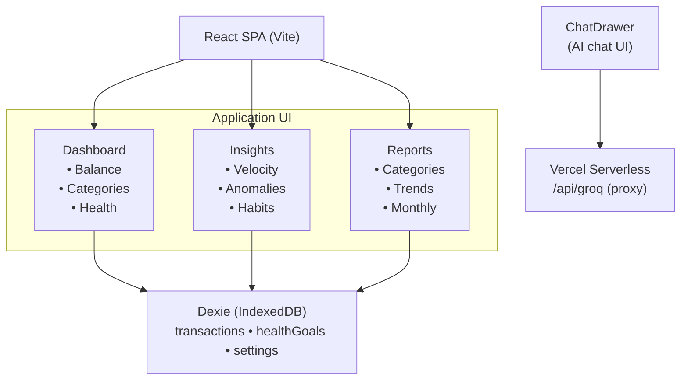

# Spendly

An offline-first personal budget tracker with AI-powered spending insights. Tracks income, expenses, and savings goals entirely in the browser using IndexedDB — no server required for core functionality. Optional Groq-powered AI chat provides personalized financial analysis.

## Problem Statement

Most budget trackers require cloud accounts, store financial data on remote servers, and lock core features behind paywalls. Users concerned about privacy have no way to track spending locally while still getting intelligent insights. Spreadsheet tracking lacks automation and visual feedback.

Spendly stores all financial data in the browser's IndexedDB — nothing leaves the device unless the user explicitly enables AI chat. The app works fully offline as a PWA, with AI as an opt-in enhancement.

## Features

- **Offline-first PWA** — installs to home screen, works without internet
- **Local-only data** — all transactions stored in IndexedDB, zero server dependency
- **AI spending insights** — Groq-powered chat analyzes spending patterns, detects anomalies, and suggests savings
- **Multi-currency** — 30+ currencies with real-time symbol formatting
- **Health scoring** — sets spending/earning targets and tracks budget health on a 1-10 scale
- **Spending velocity** — calculates daily burn rate and monthly projections
- **Category analytics** — breakdown by category with trend detection
- **Reports** — monthly and all-time views with income/expense/balance/savings rate
- **Dark/light theme** — system-aware with manual toggle
- **Avatar customization** — gradient picker or photo upload

## Architecture



## Tech Stack

| Layer | Technology | Purpose |
|---|---|---|
| Frontend | React 19 + Vite | SPA with fast HMR |
| Styling | Tailwind CSS v4 | Utility-first design system |
| Database | Dexie.js (IndexedDB) | Local-first data persistence |
| Routing | React Router v7 | Client-side navigation |
| Charts | Recharts | Spending visualizations |
| Icons | Lucide React | Consistent icon system |
| AI | Groq API (openai/gpt-oss-20b) | Financial analysis chat |
| PWA | vite-plugin-pwa | Offline support + install |
| Deploy | Vercel | Serverless API proxy |

## Key Engineering Features

**Local-first data model:** All financial data lives in IndexedDB via Dexie.js. No cloud sync, no account system, no tracking. The app functions fully offline after first load. Data persists across sessions without any server round-trip.

**AI integration without data lock-in:** The optional AI chat sends spending summaries (not raw transactions) to Groq's API through a Vercel serverless proxy. The proxy keeps the API key server-side. Users can ignore AI features entirely — core budget tracking works without it.

**Spending velocity algorithm:** Calculates daily burn rate from recent transactions, extrapolates month-end totals, and compares week-over-week trends. This provides early warning when spending accelerates beyond normal pace.

**Health scoring system:** Converts spending/income targets into a 1-10 health score by comparing actual vs. target amounts across all active goals. The score animates on load and updates in real-time as transactions are added.

**Markdown AI responses:** The chat drawer parses markdown from AI responses — tables, bold text, numbered lists, and headers render as styled HTML without any external markdown library.

## Installation & Setup

**Prerequisites:** Node.js 18+

```bash
git clone https://github.com/nabeelsyed14/spendly.git
cd spendly
npm install
```

**Development (without AI):**
```bash
npm run dev
```

**Development (with AI chat):**
1. Get a free API key from [console.groq.com](https://console.groq.com)
2. Create `.env.local` in the project root:
   ```
   VITE_GROQ_API_KEY=gsk_your_key_here
   ```
3. Run `npm run dev`

**Production build:**
```bash
npm run build
npm run preview
```

**Deploy to Vercel:**
1. Push to GitHub
2. Import in Vercel dashboard
3. Add `GROQ_API_KEY` environment variable in Vercel project settings
4. Deploy — the `api/` directory auto-configures as serverless functions

## Project Structure

```
spendly/
├── api/
│   └── groq.js              # Vercel serverless proxy for Groq API
├── public/
│   └── favicon.svg          # App icon (teal wallet)
├── src/
│   ├── components/
│   │   ├── ai/
│   │   │   └── ChatDrawer.jsx       # AI chat slide-out panel
│   │   ├── dashboard/
│   │   │   ├── BalanceCard.jsx       # Main balance display
│   │   │   ├── CategoryChart.jsx     # Spending by category
│   │   │   ├── HealthScore.jsx       # Budget health goals
│   │   │   └── TrendChart.jsx        # Daily spending trend
│   │   ├── goals/
│   │   │   └── GoalsPage.jsx         # Savings goal management
│   │   ├── insights/
│   │   │   └── InsightsPage.jsx      # Velocity, projections, anomalies
│   │   ├── layout/
│   │   │   ├── Header.jsx            # Top bar (mobile logo + settings)
│   │   │   ├── Sidebar.jsx           # Desktop nav + mobile bottom bar
│   │   │   └── Navigation.jsx        # (unused, kept for reference)
│   │   ├── reports/
│   │   │   └── ReportsPage.jsx       # Monthly/all-time reports
│   │   ├── settings/
│   │   │   └── SettingsPage.jsx      # Theme, currency, profile, categories
│   │   ├── transactions/
│   │   │   ├── TransactionForm.jsx   # Add/edit transaction modal
│   │   │   └── TransactionList.jsx   # Transaction history + search
│   │   └── ui/
│   │       ├── Avatar.jsx            # Initials/photo avatar
│   │       ├── AvatarPicker.jsx      # Gradient/photo picker
│   │       ├── CurrencyPicker.jsx    # Currency selection modal
│   │       └── Modal.jsx             # Reusable modal wrapper
│   ├── context/
│   │   ├── CurrencyContext.jsx       # Currency state + formatting
│   │   ├── ProfileContext.jsx        # User name + avatar
│   │   └── ThemeContext.jsx          # Dark/light mode
│   ├── hooks/
│   │   └── useData.js               # Dexie query hooks
│   ├── lib/
│   │   ├── ai.js                    # Groq API integration
│   │   ├── db.js                    # Dexie database schema
│   │   └── insights.js              # Analytics algorithms
│   ├── App.jsx                      # Router + layout
│   ├── index.css                    # Global styles + animations
│   └── main.jsx                     # Entry point
├── .gitignore
├── .oxlintrc.json
├── index.html
├── package.json
├── vite.config.js
└── README.md
```

## Security & Privacy

**Data storage:** All financial data is stored in the browser's IndexedDB. No data is sent to any server unless you explicitly use the AI chat feature.

**AI chat:** When enabled, spending summaries (category totals, daily averages, anomalies) are sent to Groq's API for analysis. Raw transaction details are not sent — only aggregated summaries. The API key is stored server-side in Vercel environment variables, never exposed to the client.

**Local development:** For local dev with AI, create `.env.local` with your Groq API key. This file is gitignored and never committed.

**No tracking:** No analytics, no cookies, no telemetry. The app has zero external dependencies that phone home.

## Known Limitations

- **No cloud sync:** Data is device-specific. Clearing browser data removes all transactions.
- **No import/export:** Cannot migrate data between devices without manual IndexedDB export.
- **AI requires internet:** The AI chat feature needs an active internet connection and a Groq API key.
- **Single currency:** The app uses one currency at a time (changeable in settings).
- **No recurring transactions:** Each transaction must be entered manually.

## License

MIT
